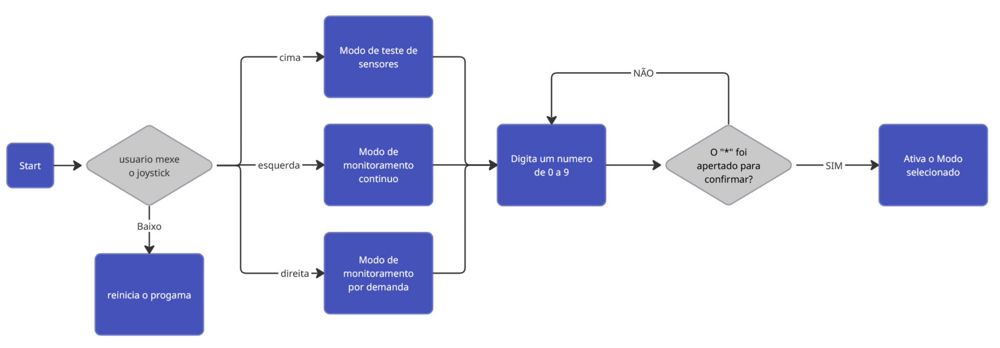

# Descrição de Funcionamento do Programa

Ao iniciar o programa, o usuário deve mover o *joystick* nas seguintes direções para acessar as configurações:

* **Para a direita:** Modo de monitoramento por demanda.
* **Para a esquerda:** Modo de monitoramento contínuo.
* **Para cima:** Modo de teste de sensores.
* **Para baixo:** Termina o programa.

Após a seleção da configuração, o usuário deve confirmar através da interface e apertar $\mathbf{( * )}$. Em seguida, deve definir a distância de **1 a 4 metros** pela interface e confirmar novamente. Se a entrada for inválida, o sistema solicitará o número novamente.

---

### Modos de Operação

#### 1. Modo de Teste de Sensores
Ao ser selecionado, as luzes se acendem caso os sensores estejam funcionando corretamente.

#### 2. Modo de Monitoramento por Demanda
Ao ser selecionado, os sensores de infravermelho e som são ativados. Se a área for cruzada, o alarme é disparado. O disparo pode ser evitado com o uso da *tag* (chave de acesso).

#### 3. Modo de Monitoramento Contínuo
Ao ser selecionado, os sensores monitoram periodicamente a área. Caso o usuário ultrapasse a área definida e **não** utilize a *tag*, o alarme é disparado.

---

